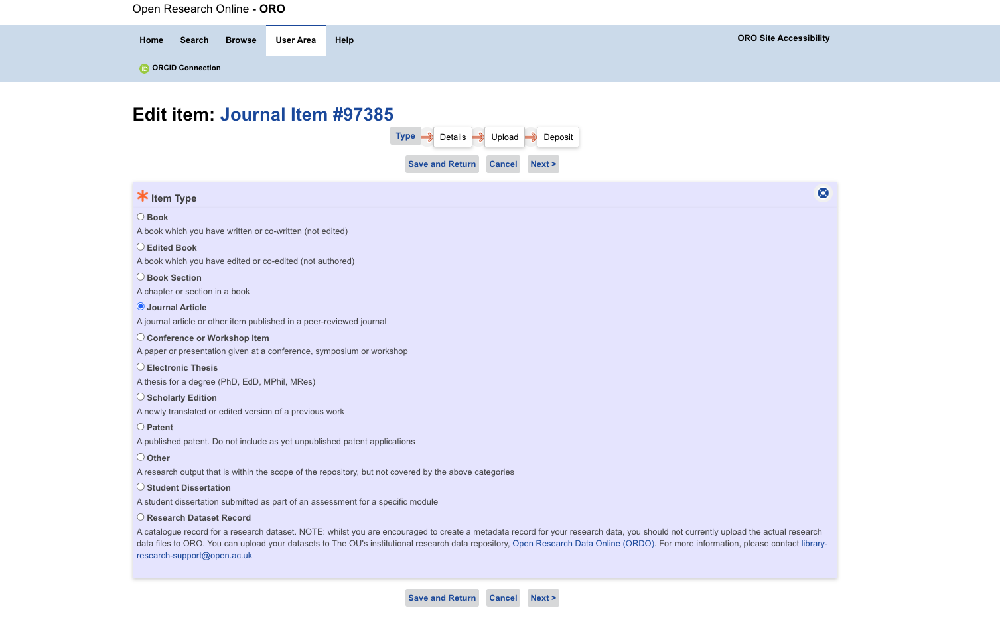

# Step 2: Author deposits manuscript 

## Context

A research team has completed the writing of a research article and wishes to share the manuscript in an Open Access repository. 

**The trigger:** Article describing software usage or development ready for dissemination. 

**End result**: Article metadata record in OA, possibly with software reference included in the record and in OAI-PMH metadata. 


## Action

### 2.1 The Author or research team deposits the manuscript in an Open Access repository

The linking of the manuscript and software asset begins when an author first deposits a new manuscript with their institutional repository. CORE is repository platform-agnostic and merely requires that the repository exposes its metadata records via the OAI-PMH protocol. This is covered in more detail in step 3 below. How the author uploads the manuscript to the repository will vary slightly depending on the platform being used by the author’s institute, however the process is similar across most repository platforms. CORE has produced a [Data Providers Guide](https://core.ac.uk/documentation/data-providers-guide) that details configuration requirements and best practices for repositories.  

Shown below (Figure 1) is an example of how the author uploads their manuscript using Open Research Online (ORO), The Open University’s repository platform. ORO is an example of an [ePrints](https://eprints.soton.ac.uk/256840/)-based repository.



*Figure 1: Uploading a manuscript to ORO*

#### 2.1.1 Request for modification in specific OA repositories, a moderation step will provide a review of the manuscript and metadata.

#### 2.1.2 Research team provides response to OA

#### 2.1.3 Publication of manuscript in OA and notification to author

### 2.2 OA notify reasons for rejection

### 2.3 The OA exposes metadata in as part of the metadata record, to be harvested using OAI-PMH protocol, using one of the following:

The current basic Dublin Core metadata standard does not specify in detail how a software mention should be specified, however even if not explicitly the most common metadata extension for research papers allow the definition of the software mention using the “relation” tags.

```
<dc:relation>SWHID<dc:relation>
```


[RIOXX](https://rioxx.net/profiles/) offers the tag [`rioxx:ext_relation`](https://rioxx.net/profiles/#rioxxterms:ext_relation), a possible example of a software mention should look something like this:

```
<rioxxterms:ext_relation 
   rel="cite-as"            
   coar_type="https://purl.org/coar/resource_type/c_5ce6">
           SWHID
</rioxxterms:ext_relation>
```

OpenAire guidelines use [`datacite:relatedIdentifier`](https://openaire-guidelines-for-literature-repository-managers.readthedocs.io/en/v4.0.0/field_relatedidentifier.html#dci-relatedidentifier)

```
<datacite:relatedIdentifiers>
   <datacite:relatedIdentifier relatedIdentifierType="URL" relationType="Cites">SWHID</datacite:relatedIdentifier>
</datacite:relatedIdentifiers>
```

## Extra information for infrastructures on software metadata and citation 

An OA repository could provide metadata properties linking articles with complementary materials, such as software. The related software property could be a link, an extrinsic PID to a metadata record of the software or to a SWHID, directly referencing the source code artefact itself.  

Within CORE - a first step to identify that this metadata exists and the actions this metadata should trigger. For example:

* An url should be analysed if it is a forge url to directly deposit in Software Heritage, through the save code now functionality (see step 6.2.1) then exposing the SWHID, while adding to OAI-PMH export
* A SWHID directly exposed on the article metadata record, should be included in the OAI-PMH metadata
* If another PID is exposed, it should also be included in OAI-PMH but there won’t be additional archival in Software Heritage at this stage

## Best practices in metadata curation for software 

There are existing best practices in the software metadata community recommending on adding intrinsic metadata to the software repository while registering the software as a first-class output in a registry or scholarly repository. For more information, checkout the [RSMD guidelines](https://fair-impact.github.io/RSMD-guidelines/).

The article in this workflow is the main research output. 

For the complete SoFAIR workflow, the article record MAY contain in metadata properties a related resource of type software, using the code repository URL and/or directly the SWHID reference. 

The article full text MAY contain a reference to the software described in the article, using a URL or SWHID. In HAL a metadata property is available on an article record to add related resources using `see also`, this metadata property SHOULD be exposed in Dublin Core using `relation`. 
