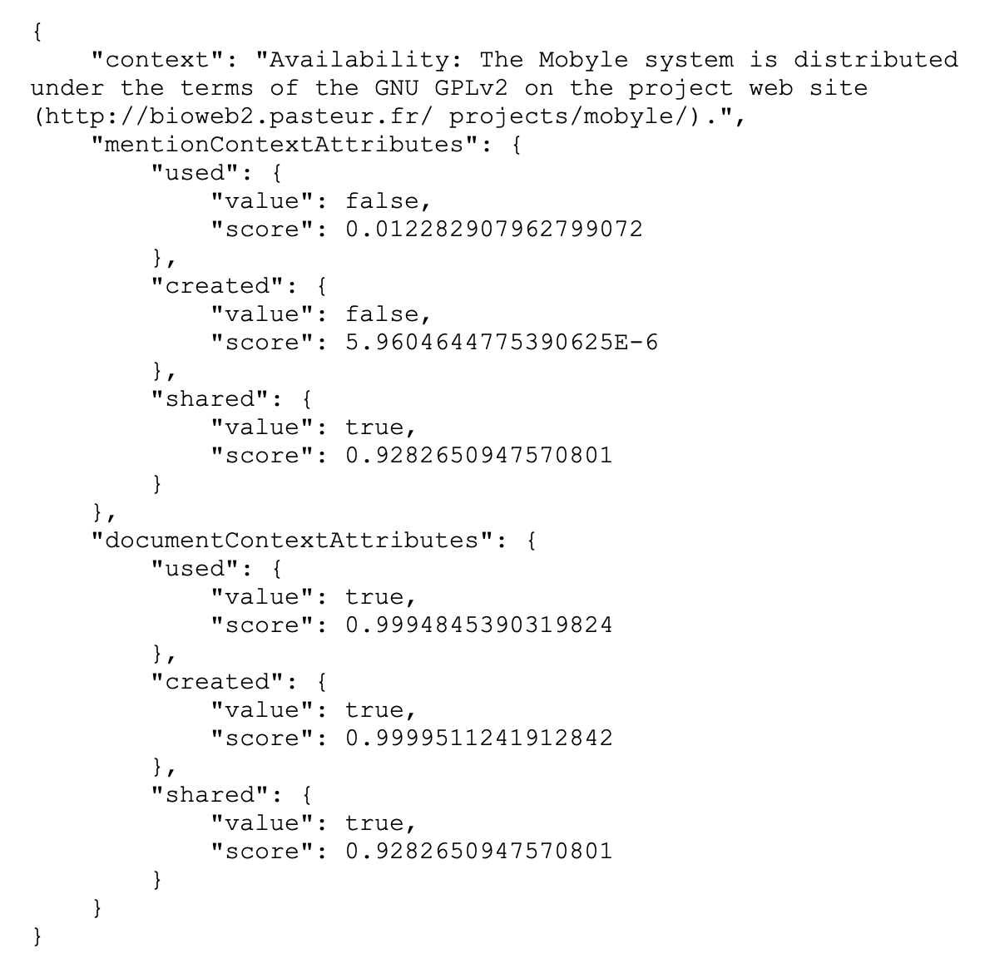

# Step 3: Extracted mention

## Context: CORE ingestion and indexing pipeline

The CORE harvesting process can be described as a pipeline where each task performs a certain action and where the output of each task feeds into the next task. The input to this pipeline is a set of data providers and the final output is a system populated with records of research papers available from them. The main types of key tasks currently performed as part of CORE’s harvesting system are described in the action section.

**The trigger:** CORE indexes a metadata record containing a software asset mention repository.

**End result**: reference of software asset to validate with Author.

## Action

### 3.1 Harvest metadata

#### 3.1.1 Metadata download

The Dublin Core metadata exposed by a data provider via OAI-PMH are downloaded and stored in the file system (typically as an XML). The downloading process is sequential, i.e. a repository provides typically between 100–1,000 metadata records per request and a resumption token. This token is then used to provide the next batch. As a result, full harvesting can take a significant amount of time (hours-days) for large data providers. Therefore, this process has been implemented to provide resilience to a range of communication failures.

#### 3.1.2 Metadata extraction

Metadata extraction parses, cleans, and harmonises the downloaded metadata and stores them into the CORE internal data structure (database). The harmonisation and cleaning process addresses the fact that different data providers/repository platforms describe the same information in different ways (syntactic heterogeneity) as well as having different interpretations for the same information (semantic heterogeneity).

#### 3.1.3 Full text download 

Using links extracted from the metadata CORE attempts to download and store publication manuscripts.

#### 3.1.4 Conversion from text to semi-structured format

Plain text from the downloaded manuscripts is extracted and processed to create a semi-structured representation. This process includes a range of information extraction tasks, such as references extraction. In this step we perform a Grobid+Softcite extraction (described more in detail in 3.2) and we store the results. 

#### 3.1.5 Enrichment

The enrichment task works by increasing both metadata and full text harvested from the data providers with additional data from multiple sources. Some of the enrichments are performed directly by specific tasks in the pipeline such as language detection and document type detection. The remaining enrichments that involve external datasets are performed externally and independently to the CHARS pipeline and ingested into the dataset as described in the Enrichments section. In this step, we read the Grobid+Softcite file extracted and run disambiguation and resolution (described more in detail in 3.2).

#### 3.1.6 Indexing

The final step in the harvesting pipeline is indexing the harvested data. The resulting index powers CORE’s services, including search, API and FastSync.

### 3.2 Extract software mentions (T6.2)

The following steps will be integrated as part of the overall CORE ingestion and extraction pipeline: 

#### 3.2.1 Manuscript parsed by SoftCite / Grobid

Where a full text manuscript has been discovered and downloaded during the CHARS process (section 3.1.3 above), the parsing of the manuscript using SoftCite will be integrated as a part of the Information enrichment process (3.1.4). This will identify software mentions and the links to the appropriate software repository contained within the fulltext manuscript.  

The JSON metadata output from the Softcite module for each paper (See Figure 1 below) is then combined with the OAI-PMH metadata from the paper itself to then be marked for validation by the author. 

*Figure 1: Sample JSON output from Softcite*

This information is collated on a per-repository basis and will be sent to the author, via the repository for validation as described in Step 4 below. 

#### 3.2.2 Disambiguation of existing software asset  

Given the name of software and its basic information described as metadata (e.g CodeMeta), determine the correct code repository including its base URL.
For example, in the manuscript, the name of software `<Octopus>` was mentioned and extracted. We know it was created by the authors. There are 20 repositories in Github with the same name. Determine which repository was meant and retrieve its base URL.

#### Disambiguation of software usage

Softcite already attempts to disambiguate between several types of software usage. Every mentioned software in a document is automatically enriched with usage, creation and sharing information based on the different software mention contexts in the document. In the JSON results, mentioned software are characterised with the following attributes:

* Used: the mentioned software is used by the research work disclosed in the document
* Created: the mentioned software is a creation of the research work disclosed in the document or the object of a contribution of the research work
* Shared: software is claimed to be shared publicly via a sharing statement (note: this does not necessarily mean that the software is Open Source)

#### Disambiguation of software correct url

Disambiguation can relate to different possibilities, such as:

- incomplete metadata exposed by the OA
- accuracy of the extracted mentions
- primary research software introduced

Even if a mention of the primary software is found, it is important to note that Software is a complex artefact and the development of this artefact may have occurred under different urls with the common practice of using forks. For this reason the validation of the mention and url by the author is necessary in step 4.
